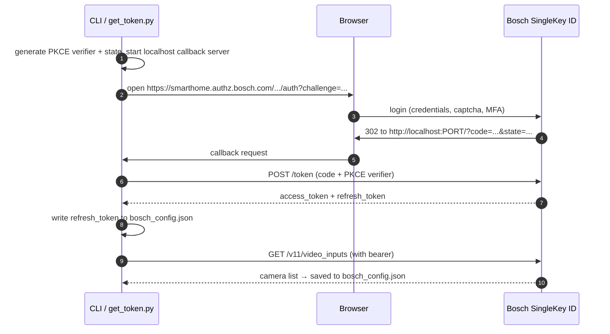
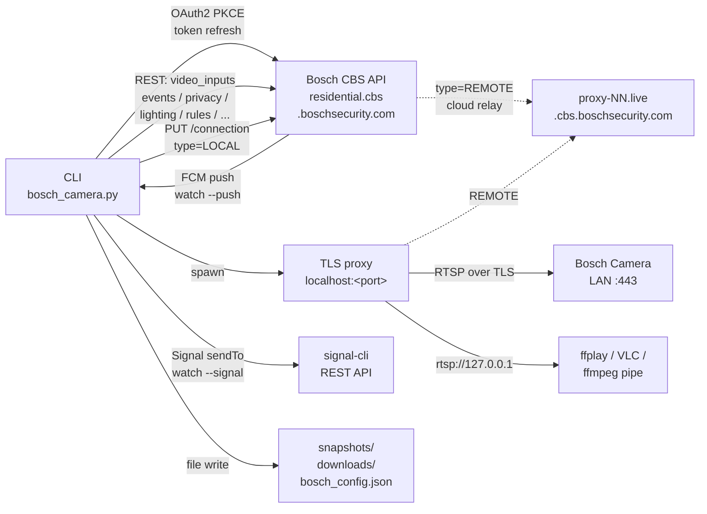
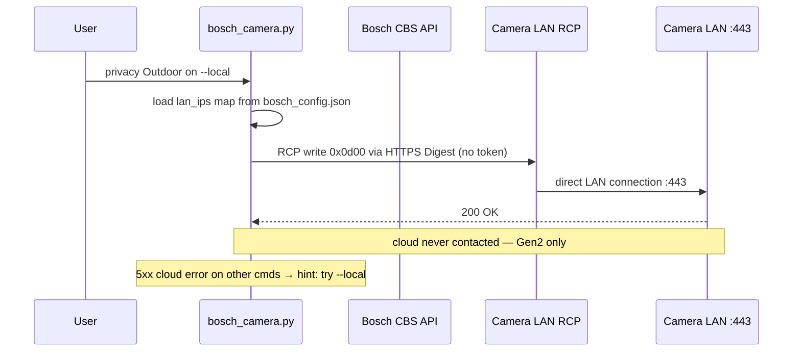
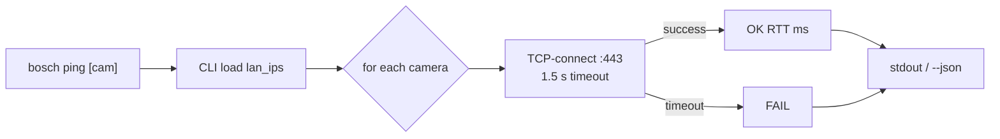
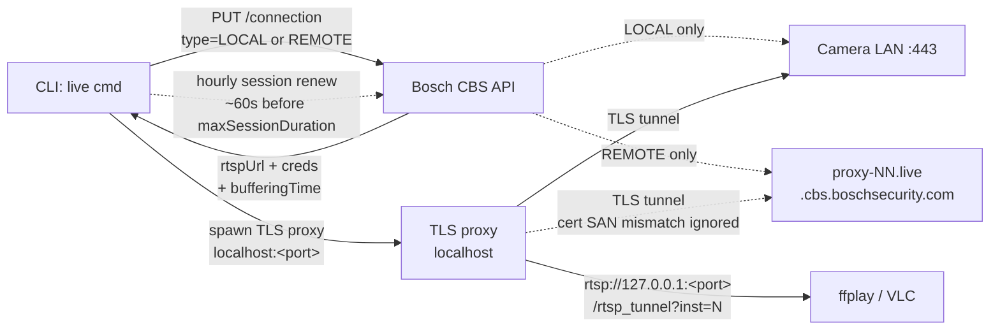

# Bosch Smart Home Camera — Python CLI Tool

Standalone Python CLI for Bosch Smart Home cameras (Eyes Außenkamera, 360 Innenkamera, Gen1+Gen2). Live snapshots, live video stream (cloud + local LAN), privacy mode, light, notifications, pan control, intercom, camera sharing, automation rules, RCP protocol reads, real-time event watching, and **Mini-NVR (BETA)** — all from the command line. No official API. No app needed after setup.

**Reverse-engineered Bosch Cloud API.** See [Disclaimer](#disclaimer).

[![GitHub Release][releases-shield]][releases]
[![GitHub Activity][commits-shield]][commits]
[![License][license-shield]](LICENSE)

[![Project Maintenance][maintenance-shield]][user_profile]
[![BuyMeCoffee][buymecoffeebadge]][buymecoffee]

[![Community Forum][forum-shield]][forum]


[releases-shield]: https://img.shields.io/github/release/mosandlt/Bosch-Smart-Home-Camera-Tool-Python.svg?style=for-the-badge
[releases]: https://github.com/mosandlt/Bosch-Smart-Home-Camera-Tool-Python/releases
[commits-shield]: https://img.shields.io/github/commit-activity/y/mosandlt/Bosch-Smart-Home-Camera-Tool-Python.svg?style=for-the-badge
[commits]: https://github.com/mosandlt/Bosch-Smart-Home-Camera-Tool-Python/commits/main
[license-shield]: https://img.shields.io/github/license/mosandlt/Bosch-Smart-Home-Camera-Tool-Python.svg?style=for-the-badge
[maintenance-shield]: https://img.shields.io/badge/maintainer-%40mosandlt-blue.svg?style=for-the-badge
[user_profile]: https://github.com/mosandlt
[buymecoffeebadge]: https://img.shields.io/badge/buy%20me%20a%20coffee-donate-yellow.svg?style=for-the-badge
[buymecoffee]: https://buymeacoffee.com/mosandlts
[forum-shield]: https://img.shields.io/badge/community-forum-brightgreen.svg?style=for-the-badge
[forum]: https://community.home-assistant.io/

---

## Table of Contents

- [Integration Comparison](#integration-comparison) — pick the right project for your platform
- [Supported Cameras](#supported-cameras)
- [Disclaimer](#disclaimer)
- [Prerequisites — Setting Up a New Camera](#prerequisites--setting-up-a-new-camera)
- [Requirements](#requirements)
- [Quick Start](#quick-start)
- [Architecture](#architecture)
  - [Network Connectivity](#network-connectivity) — required ports, VLAN/subnet pitfalls
- [Features](#features)
- [CLI Reference](#cli-reference)
  - [Status & Info](#status--info)
  - [Snapshots](#snapshots)
  - [Live Stream](#live-stream--30fps-h264--aac-audio)
  - [WebRTC Streaming](#webrtc-streaming)
  - [Privacy Mode](#privacy-mode)
  - [Camera Light](#camera-light)
  - [Push Notifications](#push-notifications)
  - [Pan](#pan-camera_360-only)
  - [Motion Detection](#motion-detection)
  - [Recording Options](#recording-options)
  - [Audio Levels](#audio-levels-mic--speaker)
  - [Intrusion Detection](#intrusion-detection-config)
  - [WiFi Info](#wifi-info)
  - [Auto-Follow](#auto-follow-camera_360-only)
  - [Intercom](#intercom)
  - [Siren](#siren-camera_360-only)
  - [Unread Events](#unread-events)
  - [Privacy Sound](#privacy-sound-camera_360-only)
  - [Rules — Cloud Automation](#rules--cloud-automation)
  - [Camera Sharing & Friends](#friends--camera-sharing)
  - [Rename](#rename)
  - [Profile](#profile)
  - [Account](#account)
  - [RCP Protocol Reads](#rcp-protocol-reads)
  - [Watch — Real-Time Event Monitoring](#watch--real-time-event-monitoring)
  - [Token Management](#token-management)
  - [Config & Rescan](#config--rescan)
- [Mini-NVR (BETA)](#nvr-beta)
- [How It Works](#how-it-works)
- [Cloud API Reference](#cloud-api-reference)
- [RCP Protocol — Low-Level Camera Reads](#rcp-protocol--low-level-camera-reads)
- [Undocumented API Endpoints (from iOS App Analysis)](#undocumented-api-endpoints-from-ios-app-analysis)
- [Camera Models](#camera-models)
- [Event Types](#event-types)
- [API Error Codes](#api-error-codes)
- [Config File Reference](#config-file-reference)
- [Troubleshooting](#troubleshooting)
- [Example: Event Monitoring & Automation](#example-event-monitoring--automation)
- [Known Limitations](#known-limitations)
- [File Structure](#file-structure)
- [Releases](#releases) · [Full changelog](CHANGELOG.md) · [GitHub Releases](https://github.com/mosandlt/Bosch-Smart-Home-Camera-Tool-Python/releases)
- [Related Projects](#related-projects)
- [References](#references)
- [License](#license)

---

## Integration Comparison

The Bosch Smart Home Camera reverse-engineered API is exposed via four sibling projects. Pick the one that fits your platform.

| Feature | [Home Assistant Integration](https://github.com/mosandlt/Bosch-Smart-Home-Camera-Tool-HomeAssistant) | [Python CLI Tool](https://github.com/mosandlt/Bosch-Smart-Home-Camera-Tool-Python) | [ioBroker Adapter](https://github.com/mosandlt/ioBroker.bosch-smart-home-camera) | [MCP Server](https://github.com/mosandlt/Bosch-Smart-Home-Camera-Tool-MCP) |
|---|---|---|---|---|
| **Maturity** | v13.5+ — HA Quality Scale **Platinum** | v10.10+ stable (Mini-NVR BETA) | v1.5+ stable · npm | v1.5+ stable · PyPI |
| **Platform** | Home Assistant (HACS) | Standalone Python 3.10+ CLI | ioBroker (npm) | Python 3.10+ · pipx / uvx · stdio + streamable-HTTP for MCP clients (Claude Desktop, Claude Code, custom) |
| **Login** | OAuth2 PKCE (browser) | OAuth2 PKCE (browser) | OAuth2 PKCE (browser) | OAuth2 PKCE (browser, one-time) |
| **Snapshots** | ✅ Native `Camera.image` | ✅ `snapshot` command | ✅ File-store + base64 DP | ✅ `bosch_camera_snapshot` (LAN-only) |
| **Live RTSP stream (LAN)** | ✅ via HA Stream component | ✅ ffmpeg/RTSPS output | ✅ TLS proxy → local RTSP | ✅ `bosch_camera_stream_url` (LAN-only, no cloud relay) |
| **WebRTC (sub-second latency)** | ✅ via integrated go2rtc | ✅ *(v10.6.0)* `live --webrtc` | ❌ | ❌ |
| **Dual-stream URL (main + sub)** | ✅ `sensor.bosch_<n>_stream_url` + `_sub` *(v12.4.0, opt-in per cam)* | ✅ `info` shows both · `live --sub` *(v10.5.0)* | ✅ `stream_url` + `stream_url_sub` *(v0.5.3 experimental)* | ◑ `bosch_camera_stream_url` — main stream only |
| **External recorder (BlueIris, Frigate)** | ✅ via go2rtc | ✅ stdout pipe | ✅ Digest-creds URL + LAN bind option | ✅ URL returned, hand off to ffmpeg / go2rtc downstream |
| **Privacy mode** | ✅ switch entity | ✅ command | ✅ DP | ✅ `bosch_camera_privacy_set` (LAN-fallback via `prefer_local`) |
| **Front spotlight (Gen1/Gen2)** | ✅ light entity | ✅ command | ✅ DP | ✅ `bosch_camera_light_set` (LAN-fallback) |
| **RGB wallwasher (Gen2 Outdoor II)** | ✅ light w/ RGB | ◑ on/off only — no RGB | ✅ color + brightness DPs | ❌ *(on/off only — RGB not exposed)* |
| **Panic-alarm siren** | ✅ button entity *(Gen2 Indoor II)* | ✅ command *(Gen2 Indoor II only)* | ✅ DP | ✅ `bosch_camera_siren_trigger` *(Gen2 Indoor II only)* |
| **Image rotation 180°** | ✅ switch | ❌ | ✅ DP | ❌ |
| **Motion / person / audio events** | ✅ FCM push + polling fallback | ◑ `watch` command only (events cmd removed) | ✅ FCM push + polling fallback | ✅ `bosch_camera_events` (on-demand pull) |
| **Motion edge-trigger state** | ✅ `binary_sensor.motion` | n/a | ✅ `motion_active` DP *(v0.5.3)* | n/a *(request-response, no subscription)* |
| **Auto-snapshot on motion** | ✅ refreshes Camera entity | n/a | ✅ writes `last_event_image` base64 *(v0.5.3)* | n/a *(no background loop)* |
| **Synthetic motion trigger (external sensor)** | ✅ service | n/a | ✅ DP | ❌ |
| **Motion zones / privacy masks (read)** | ✅ | ✅ | ✅ read-only *(v1.2.0)* | ❌ |
| **Automation rules / schedules (read)** | ✅ | ✅ | ◑ read-only count + JSON *(v1.2.0)* | ❌ |
| **Lighting schedule (read)** | ✅ | ✅ | ✅ read *(Gen1-only, v1.2.0)* | ❌ |
| **Cloud clip download (history ~30 d)** | ✅ via Media Browser | ❌ | ❌ *(parked — no community request yet)* | ❌ *(intentionally not exposed — large payloads)* |
| **Mini-NVR (motion-triggered local recording)** | ✅ *(v11.2.0 BETA)* | ✅ *(v10.7.0 BETA)* | ❌ | ❌ |
| **SMB / NAS clip upload** | ✅ | ✅ *(v10.7.0 BETA)* | ❌ | ❌ |
| **Camera sharing (friends)** | ✅ services (share / invite / list) | ✅ command | ◑ read-only list *(v1.2.0)* | ❌ *(intentionally not exposed — needs user-driven flow)* |
| **Pan / tilt (360° Gen1)** | ✅ services | ✅ command | ✅ `pan_position` DP | ✅ `bosch_camera_pan` |
| **Named pan presets (home / left / right / back-left / back-right)** | ✅ opt-in select entity | ✅ `pan --preset` flag | ✅ `pan_preset` DP | ✅ `bosch_camera_pan preset=` |
| **Two-way audio / intercom** | ❌ | ✅ command | ❌ | ❌ *(intentionally not exposed — timing-sensitive)* |
| **Webhook delivery on events** | ✅ service + opt-in options | ✅ `watch --webhook URL` | ✅ via MQTT bridge | ❌ *(request-response model)* |
| **MQTT event bridge (motion / audio / person)** | n/a *(HA event bus native)* | n/a *(single-run)* | ✅ admin-config | n/a |
| **Apple HomeKit (via HA Core bridge)** | ✅ documented | n/a | n/a | n/a |
| **Snapshot scheduler / time-lapse** | ✅ examples/ YAML | ✅ cron + ffmpeg examples | ✅ Blockly example | n/a |
| **Native dashboard card / widget** | ✅ 2 Lovelace cards (single + grid) | n/a | ✅ VIS-2 widget (`snapshot_path` + `stream_url`) | n/a |
| **Cloud-relay REMOTE fallback** | ✅ auto-switch when LAN unreachable | ✅ remote mode | ❌ *(LOCAL-only by design)* | ❌ *(media LAN-only; status/events via cloud)* |
| **Browser-based admin / config UI** | ✅ HA Config Flow | n/a (CLI) | ✅ JSON-config tabs | n/a (LLM-mediated; config via CLI / MCP client) |
| **UI languages** | EN · DE · FR · ES · IT · NL · PL · PT · RU · UK · ZH-Hans *(v12.4.0)* | EN · DE · FR · ES · IT · NL · PL · PT · RU · UK · ZH-Hans *(v10.3.0)* | EN · DE · FR · ES · IT · NL · PL · PT · RU · UK · ZH-CN | n/a *(no UI — LLM is the front-end)* |

**Legend:** ✅ supported · ❌ not supported / not planned · n/a not applicable for this platform.

> All four projects share the same reverse-engineered Cloud API + RCP protocol research, but evolve independently. The Home Assistant integration is the most feature-complete reference implementation; the Python CLI is the lowest-level / scriptable surface; the ioBroker adapter targets VIS dashboards and Blockly automations; the MCP server exposes a curated, LAN-first tool surface to MCP clients (Claude Desktop, Claude Code, custom) for natural-language camera control.

---

## Supported Cameras

All four current Bosch Smart Home cameras are supported.

| Camera | Generation | Type | Codec / FW seen | Highlights |
|---|---|---|---|---|
| [**360° Innenkamera**](https://www.bosch-smarthome.com/de/de/produkte/sicherheitsprodukte/360-grad-innenkamera/) | Gen1 | Indoor | H.264 + AAC · FW 7.91.x | Pan/tilt motor, autofollow, IR night vision, mechanical privacy shutter |
| [**Eyes Innenkamera II**](https://www.bosch-smarthome.com/de/de/produkte/sicherheitsprodukte/eyes-innenkamera-2/) | Gen2 | Indoor | H.264 + AAC · FW 9.40.x | Built-in 75 dB siren, Audio+ glass-break / smoke / CO, ZONES detection mode, RGB LEDs, retractable head |
| [**Eyes Außenkamera**](https://www.bosch-smarthome.com/de/de/produkte/sicherheitsprodukte/eyes-aussenkamera/) | Gen1 | Outdoor (IP66) | H.264 + AAC · FW 7.91.x | Front spotlight, motion-triggered light, ambient-light sensor |
| [**Eyes Außenkamera II**](https://www.bosch-smarthome.com/de/de/produkte/sicherheitsprodukte/eyes-aussenkamera-2/) | Gen2 | Outdoor (IP66) | H.264 + AAC · FW 9.40.x | Front + Top + Bottom RGB LED groups, DualRadar (motion + intrusion), wallwasher mode |

---

## Disclaimer

**This project is an independent, community-developed tool. It is not affiliated with, endorsed by, sponsored by, or in any way officially connected to Robert Bosch GmbH, Bosch Smart Home GmbH, or any of their subsidiaries or affiliates. "Bosch", "Bosch Smart Home", and related names and logos are registered trademarks of Robert Bosch GmbH.**

This tool communicates with a reverse-engineered, undocumented, and unofficial API. The author(s) provide this software **"as is", without warranty of any kind**, express or implied, including but not limited to warranties of merchantability, fitness for a particular purpose, or non-infringement.

**By using this software, you agree that:**

- You use it entirely **at your own risk**.
- The author(s) shall not be held liable for any direct, indirect, incidental, special, or consequential damages arising from the use of, or inability to use, this software — including but not limited to data loss, service disruption, account suspension, or device damage.
- The API may be changed, restricted, or shut down by Bosch at any time without notice, which may render this tool non-functional.
- You are solely responsible for ensuring your use complies with Bosch's Terms of Service and any applicable laws in your jurisdiction.
- All rights and any legal recourse are expressly disclaimed by the author(s). Any use of this software is entirely your own responsibility.

**Reverse engineering notice:** The API was discovered solely for the purpose of achieving interoperability with the user's own devices and data, which is explicitly permitted under **§ 69e of the German Copyright Act (UrhG)** and **Article 6 of EU Directive 2009/24/EC** on the legal protection of computer programs. No copy of Bosch's software was distributed. Only network protocol observations were used.

---

## Prerequisites — Setting Up a New Camera

Before using this tool, your camera **must** be fully set up in the official **Bosch Smart Camera** app first.

1. **Unbox and power on** the camera
2. **Open the Bosch Smart Camera app** and follow the pairing wizard to add the camera to your account
3. **Wait for the firmware update** — new cameras typically receive a Zero-Day update during first setup. This can take **up to 1 hour**. The camera's LED blinks yellow/green during the update.
   - **Do not unplug or restart** the camera during the update
   - If the LED blink pattern doesn't change after 1 hour, leave the camera alone for up to 24 hours ([Bosch Support](https://www.bosch-smarthome.com/de/de/support/hilfe/hilfe-zum-produkt/hilfe-zur-eyes-aussenkamera-2/))
   - The app shows the update status — wait until it reports the camera as ready
4. **Verify the camera works** in the Bosch app — check live stream, settings, and notifications
5. **Then use this CLI tool** to control it (see Quick Start below)

For more help with camera setup, see:
- [Eyes Außenkamera II — Bosch Support](https://www.bosch-smarthome.com/de/de/support/hilfe/hilfe-zum-produkt/hilfe-zur-eyes-aussenkamera-2/)
- [Eyes Innenkamera II — Bosch Support](https://www.bosch-smarthome.com/de/de/support/hilfe/hilfe-zum-produkt/hilfe-zur-eyes-innenkamera-2/)
- [Firmware Update dauert lange — Bosch Community](https://community.bosch-smarthome.com/t5/technische-probleme/wie-lange-dauert-das-update-der-software-bei-mir-l%C3%A4uft-es-seit-%C3%BCber-20-minuten/td-p/71764)

---

## Requirements

```bash
pip3 install requests
brew install ffmpeg          # macOS — provides ffplay for live video
```

Python 3.10+ required (uses `str | None` union type syntax).

---

## Quick Start

### 1. First run

```bash
python3 bosch_camera.py
```

On first run the tool:
1. Creates `bosch_config.json` with empty defaults
2. Opens your browser for a one-time Bosch SingleKey ID login
3. Saves the `refresh_token` — all future logins are silent and automatic
4. Discovers all your cameras and saves them to config
5. Asks for the local IP of each camera (optional, press Enter to skip)
6. Opens the interactive menu

#### Browser OAuth2 PKCE flow



### 2. Interactive menu

Run without arguments to get the menu:

```
╔══════════════════════════════════════════════════════════╗
║        Bosch Smart Home Camera — Control Panel           ║
╚══════════════════════════════════════════════════════════╝

  1)  Camera status (ONLINE / OFFLINE)
  2)  Camera info (full details + stream URLs)
  3)  Latest event snapshot — Outdoor
  4)  Latest event snapshot — Indoor
  5)  Latest event snapshot — ALL cameras
  6)  Live snapshot — Outdoor  (remote/local)
  7)  Live snapshot — Indoor  (remote/local)
  8)  Live stream — Outdoor (ffplay, audio+video)
  9)  Live stream — Indoor (ffplay, audio+video)
  10) Live stream — Outdoor (VLC, audio+video)
  11) Live stream — Indoor (VLC, audio+video)
  ...
  0)  Exit
```

Press a number, the command runs, then press Enter to return to the menu.

---

## Architecture



### LAN-fallback: `--local` flag



### Network Connectivity

The CLI host must be able to reach each camera's IP on the LAN. The Bosch cloud auto-discovers the camera IP, but stream/snapshot/RCP traffic flows directly from the CLI host to the camera. If a firewall, VLAN boundary, or guest network blocks that path, `--local` snapshots fail and live streams stay on the cloud relay.

#### Required ports

| Direction | Protocol / Port | Purpose | Required |
|---|---|---|---|
| CLI host → camera IP | **TCP/443** | Snapshots (`--local`), camera REST API, RTSPS live stream | **Yes for `--local`** |
| CLI host → `*.boschsecurity.com` | TCP/443 | OAuth, REMOTE/cloud stream, FCM push registration | Yes |
| CLI host → `fcm.googleapis.com` / `mtalk.google.com` | TCP/5228 | FCM push (`watch --push`); falls back to polling if blocked | Optional |

#### Common pitfalls

- **Camera in a different subnet/VLAN than the CLI host** — router/firewall must allow CLI-host outbound to the camera's IP on TCP/443.
- **IoT/guest network isolation** (FRITZ!Box "Gastzugang", Unifi guest network) blocks LAN-to-LAN by default.
- **Camera reachable from the Bosch app but not from the CLI** — the app talks via cloud, so this proves nothing about LAN reachability.

#### Quick check

```bash
nc -vz 192.168.x.y 443
# or
curl -k -v --connect-timeout 5 https://192.168.x.y/
```

If both time out, the issue is between your host and the camera (network/firewall), not the CLI. Use `bosch ping --local` to confirm — it returns `LOCAL: unreachable` with the same root cause.

### `bosch ping` flow



---

## Features

| Feature | Command |
|---------|---------|
| Camera status (ONLINE / OFFLINE) | `status` |
| Full camera info + live stream URLs | `info` |
| Latest event snapshot (motion-triggered JPEG) | `snapshot` |
| Live snapshot — current image, ~1.5 s | `liveshot` |
| **Live stream — 30fps H.264 + AAC audio** | `live` |
| Live stream in VLC | `live --vlc` |
| Live stream — high quality | `live --hq` or `live --quality high` |
| Live stream — low bandwidth | `live --quality low` |
| Live stream — select instance | `live --inst N` |
| **Live stream sub-stream (lower bandwidth)** | `live --sub` |
| **Live stream WebRTC (sub-second latency, browser)** | `live --webrtc [cam]` |
| **Live stream LOCAL (LAN, TLS proxy)** | `live --local [cam]` |
| **Live stream LOCAL + best quality** | `live --local --quality high [cam]` |
| **Privacy mode — get/set via cloud API** | `privacy [cam] [on\|off]` |
| **Camera light — on/off via cloud API** | `light [cam] [on\|off]` |
| **Push notifications — on/off** | `notifications [cam] [on\|off]` |
| **Pan 360 camera** | `pan [cam] [--preset home\|left\|right\|back-left\|back-right] [<-120..120>]` |
| **RCP reads via cloud proxy** | `rcp [cam] <info\|clock\|snapshot\|alarms\|...>` |
| **Real-time event watching** | `watch [cam] [--interval N] [--duration N] [--auto-snapshot]` |
| **Real-time via FCM push (~2s)** | `watch [cam] --push [--auto-snapshot]` |
| **Signal alerts with snapshot** | `watch --signal http://signal:8080 --signal-sender +49... --signal-recipients +49...` |
| **Motion detection — get/set** | `motion [cam] [--enable\|--disable] [--sensitivity S]` |
| **Audio levels — mic/speaker 0-100** | `audio [cam] [--mic N] [--speaker N] [--json]` |
| **Intrusion detection config** | `intrusion [cam] [--mode indoor\|outdoor] [--sensitivity 0-7] [--distance 1-8] [--json]` |
| **WiFi info — RSSI/SSID/signal** | `wifi [cam] [--json]` |
| **Recording options — sound on/off** | `recording [cam] [--sound-on\|--sound-off]` |
| **Auto-follow — 360 camera motion tracking** | `autofollow [cam] [on\|off]` |
| **Intercom — listen to camera audio** | `intercom [cam] [--duration N] [--speaker-level N]` |
| **Siren — trigger acoustic alarm (360 only)** | `siren [cam]` |
| **Unread events count** | `unread [cam]` |
| **Push mode selection (auto/iOS/Android/polling)** | `watch --push --push-mode auto\|ios\|android\|polling` |
| **Privacy sound — audible privacy indicator** | `privacy-sound [cam] [on\|off]` |
| **Cloud automation rules** | `rules [cam] [list\|add\|edit\|delete]` |
| **Motion detection zones** | `zones [cam] [list\|set\|clear]` |
| **Privacy mask zones** | `privacy-masks [cam] [list\|set\|clear]` |
| **Lighting schedule** | `lighting-schedule [cam] [set --on HH:MM --off HH:MM]` |
| **Camera sharing with friends** | `friends [list\|invite\|share\|unshare\|resend\|remove]` |
| **Rename a camera** | `rename [cam] "New Name"` |
| **User profile management** | `profile [--name\|--language]` |
| **Account info & feature flags** | `account` |
| **Timestamp overlay — show/hide clock on video** | `timestamp [cam] [on\|off]` |
| **Notification type toggles** | `notification-types [cam] [--set movement=on person=off]` |
| Automatic token via browser login | `get_token.py` |
| Silent token renewal / token fix | `token [fix\|browser]` |
| **Mini-NVR: motion-triggered MP4 recording (BETA)** | `watch [cam] --auto-record` |
| **NVR status / list / prune / upload (BETA)** | `nvr <status\|list\|prune\|upload> [cam]` |

---

## CLI Reference

### Status & Info

```bash
python3 bosch_camera.py status
python3 bosch_camera.py info               # full details + live stream URLs
python3 bosch_camera.py info --full        # also fetch firmware, motion, audio, ambient light, WiFi
```

### Snapshots

```bash
python3 bosch_camera.py snapshot Outdoor          # latest motion-triggered JPEG
python3 bosch_camera.py liveshot Outdoor          # current live image (~1.5s)
python3 bosch_camera.py snapshot --live           # all cameras, live
python3 bosch_camera.py liveshot Outdoor --hq     # high-quality live snapshot
```

### Live Stream — 30fps H.264 + AAC Audio



```bash
python3 bosch_camera.py live Outdoor              # opens in ffplay
python3 bosch_camera.py live Outdoor --vlc        # opens in VLC
python3 bosch_camera.py live Outdoor --hq         # request high-quality (highest bitrate tier)
python3 bosch_camera.py live Outdoor --inst 1     # use stream instance 1 instead of 2
python3 bosch_camera.py live Outdoor --quality high    # 30 Mbps stream (inst=1, highQualityVideo=true)
python3 bosch_camera.py live Outdoor --quality low     # low bandwidth (inst=4, ~1.9 Mbps)
python3 bosch_camera.py live Outdoor --quality auto    # default balanced (inst=2, ~7.5 Mbps)
python3 bosch_camera.py live Outdoor --sub             # sub-stream (inst=2, ~7.5 Mbps lower bandwidth)
python3 bosch_camera.py live Outdoor --webrtc          # sub-second WebRTC in browser via go2rtc
```

### WebRTC Streaming

`live --webrtc` provides sub-second latency using [go2rtc](https://github.com/AlexxIT/go2rtc) as a local media server. Instead of ffplay/VLC, the stream opens in your browser.

**Install go2rtc:**

```bash
# macOS
brew install go2rtc

# or download from https://github.com/AlexxIT/go2rtc/releases
```

**Use:**

```bash
python3 bosch_camera.py live Outdoor --webrtc               # default port 1984
python3 bosch_camera.py live Outdoor --webrtc --webrtc-port 8090
python3 bosch_camera.py live Outdoor --webrtc --go2rtc-binary /opt/go2rtc
```

The CLI starts go2rtc, writes a temp config, waits until the HTTP port is ready, then opens `http://localhost:1984/stream.html?src=bosch_cam` in your default browser. Press Ctrl+C to stop go2rtc and clean up.

**Notes:**
- Works with REMOTE stream (cloud proxy `rtsps://`) out of the box — go2rtc handles the TLS cert skip internally.
- LOCAL mode (`--local --webrtc`) also works: the Python TLS proxy starts first, then go2rtc connects to `rtsp://127.0.0.1:<proxy-port>/...`.
- Default ICE: Google STUN. For remote networks (NAT), you may need a TURN server (not yet configurable via CLI — edit the temp config if needed).

### Privacy Mode

```bash
python3 bosch_camera.py privacy                  # show all cameras' privacy state
python3 bosch_camera.py privacy Outdoor          # show one camera's privacy state
python3 bosch_camera.py privacy Outdoor on       # enable privacy mode (indefinite)
python3 bosch_camera.py privacy Outdoor on --minutes 30  # enable privacy for 30 minutes
python3 bosch_camera.py privacy Outdoor off      # disable privacy mode
```

### Camera Light

```bash
python3 bosch_camera.py light                    # show light state (all cameras)
python3 bosch_camera.py light Outdoor            # show light state (one camera)
python3 bosch_camera.py light Outdoor on         # turn camera light on
python3 bosch_camera.py light Outdoor off        # turn camera light off
```

### Push Notifications

```bash
python3 bosch_camera.py notifications                # show notification state (all)
python3 bosch_camera.py notifications Outdoor on     # enable notifications (FOLLOW_CAMERA_SCHEDULE)
python3 bosch_camera.py notifications Outdoor off    # disable notifications (ALWAYS_OFF)
```

### Pan (CAMERA_360 Only)

```bash
python3 bosch_camera.py pan Indoor --preset home       # pan to 0° (center)
python3 bosch_camera.py pan Indoor --preset left       # pan to -60°
python3 bosch_camera.py pan Indoor --preset right      # pan to +60°
python3 bosch_camera.py pan Indoor --preset back-left  # pan to -120° (full left)
python3 bosch_camera.py pan Indoor --preset back-right # pan to +120° (full right)
python3 bosch_camera.py pan Indoor 45                  # pan to absolute position (degrees)
```

### Motion Detection

```bash
python3 bosch_camera.py motion Outdoor            # show current settings
python3 bosch_camera.py motion Outdoor --enable   # enable motion detection
python3 bosch_camera.py motion Outdoor --disable  # disable motion detection
python3 bosch_camera.py motion Outdoor --enable --sensitivity SUPER_HIGH
python3 bosch_camera.py motion Outdoor --sensitivity MEDIUM
```

### Recording Options

```bash
python3 bosch_camera.py recording Outdoor         # show current settings
python3 bosch_camera.py recording Outdoor --sound-on   # record with audio
python3 bosch_camera.py recording Outdoor --sound-off  # record without audio
```

### Audio Levels (Mic / Speaker)

```bash
python3 bosch_camera.py audio                            # show levels (all cameras)
python3 bosch_camera.py audio Outdoor                    # show mic + speaker levels
python3 bosch_camera.py audio Outdoor --mic 60           # set microphone level to 60
python3 bosch_camera.py audio Outdoor --speaker 80       # set speaker level to 80
python3 bosch_camera.py audio Outdoor --mic 60 --speaker 80  # set both
python3 bosch_camera.py audio --json                     # machine-readable JSON output
```

Levels are 0–100. API: `GET/PUT /v11/video_inputs/{id}/audio`.

### Intrusion Detection Config

```bash
python3 bosch_camera.py intrusion                          # show config (all cameras)
python3 bosch_camera.py intrusion Outdoor                  # show mode/sensitivity/distance
python3 bosch_camera.py intrusion Outdoor --mode indoor    # detection mode: ALL_MOTIONS
python3 bosch_camera.py intrusion Outdoor --mode outdoor   # detection mode: ZONES
python3 bosch_camera.py intrusion Outdoor --sensitivity 4  # sensitivity 0-7
python3 bosch_camera.py intrusion Outdoor --distance 8     # detection distance 1-8
python3 bosch_camera.py intrusion Outdoor --mode indoor --sensitivity 4 --distance 6
python3 bosch_camera.py intrusion --json
```

API: `GET/PUT /v11/video_inputs/{id}/intrusionDetectionConfig`.

### WiFi Info

```bash
python3 bosch_camera.py wifi                   # show WiFi info (all cameras)
python3 bosch_camera.py wifi Outdoor           # RSSI (dBm) + SSID + signal strength
python3 bosch_camera.py wifi --json            # machine-readable JSON output
```

Read-only. API: `GET /v11/video_inputs/{id}/wifiinfo`.

### Auto-Follow (CAMERA_360 Only)

```bash
python3 bosch_camera.py autofollow Indoor         # show current state
python3 bosch_camera.py autofollow Indoor on      # enable motion tracking
python3 bosch_camera.py autofollow Indoor off     # disable motion tracking
```

### Intercom

```bash
python3 bosch_camera.py intercom Indoor          # listen for 60s (default)
python3 bosch_camera.py intercom Outdoor --duration 120    # listen for 2 minutes
python3 bosch_camera.py intercom Indoor --speaker-level 80 # set camera speaker volume
```

### Siren (CAMERA_360 Only)

```bash
python3 bosch_camera.py siren Indoor             # trigger acoustic alarm
```

### Unread Events

```bash
python3 bosch_camera.py unread                   # show unread count for all cameras
python3 bosch_camera.py unread Outdoor            # show unread count for one camera
```

### Privacy Sound (CAMERA_360 Only)

```bash
python3 bosch_camera.py privacy-sound Indoor          # show current privacy sound state
python3 bosch_camera.py privacy-sound Indoor on       # enable audible indicator on privacy change
python3 bosch_camera.py privacy-sound Indoor off      # disable audible indicator
```

Returns HTTP 442 on outdoor cameras (not supported).

### Rules — Cloud Automation

```bash
python3 bosch_camera.py rules Outdoor                 # list all automation rules
python3 bosch_camera.py rules Outdoor add             # add a new time-based rule
python3 bosch_camera.py rules Outdoor edit RULE_ID    # edit an existing rule
python3 bosch_camera.py rules Outdoor delete RULE_ID  # delete a rule
```

### Friends — Camera Sharing

```bash
# Motion detection zones
python3 bosch_camera.py zones Outdoor                  # list current motion zones
python3 bosch_camera.py zones Outdoor set --json '[{"x":0.0,"y":0.3,"w":0.67,"h":0.7}]'  # set zones
python3 bosch_camera.py zones Outdoor clear            # remove all zones

# Privacy mask zones
python3 bosch_camera.py privacy-masks Outdoor          # list current privacy masks
python3 bosch_camera.py privacy-masks Outdoor set --json '[{"x":0.0,"y":0.0,"w":0.3,"h":0.3}]'
python3 bosch_camera.py privacy-masks Outdoor clear    # remove all masks

# Lighting schedule (outdoor cameras with LED)
python3 bosch_camera.py lighting-schedule Outdoor      # show current light schedule
python3 bosch_camera.py lighting-schedule Outdoor set --on 20:00 --off 06:00 --motion  # set schedule

python3 bosch_camera.py friends                       # list all shared contacts
python3 bosch_camera.py friends invite user@example.com  # invite a new friend
python3 bosch_camera.py friends share Outdoor FRIEND_ID  # share a camera with a friend
python3 bosch_camera.py friends unshare Outdoor FRIEND_ID # stop sharing a camera
python3 bosch_camera.py friends resend FRIEND_ID      # resend invitation email
python3 bosch_camera.py friends remove FRIEND_ID      # remove a friend
```

### Rename

```bash
python3 bosch_camera.py rename Outdoor "Garden Camera"  # rename a camera via cloud API
```

### Profile

```bash
python3 bosch_camera.py profile                       # show user profile (name, email, language)
python3 bosch_camera.py profile --name "New Name"     # update display name
python3 bosch_camera.py profile --language en          # change language preference
```

### Account

```bash
python3 bosch_camera.py account                       # show feature flags, T&C versions, subscription status
```

### RCP Protocol Reads

```bash
python3 bosch_camera.py rcp info                 # all cameras: product name, FQDN, LAN IP, MAC
python3 bosch_camera.py rcp Outdoor info         # identity for one camera
python3 bosch_camera.py rcp Outdoor clock        # real-time camera clock
python3 bosch_camera.py rcp Outdoor snapshot     # RCP JPEG thumbnail 160x90 — save + open
python3 bosch_camera.py rcp Outdoor alarms       # alarm catalog (UTF-16-BE strings)
python3 bosch_camera.py rcp Outdoor privacy      # privacy mask state read
python3 bosch_camera.py rcp Outdoor dimmer       # LED dimmer value 0-100
python3 bosch_camera.py rcp Outdoor motion       # motion zone count + coordinates
python3 bosch_camera.py rcp Outdoor services     # network services list
python3 bosch_camera.py rcp Outdoor frame        # raw video frame 320x180 YUV422 -> JPEG
python3 bosch_camera.py rcp Outdoor script       # IVA automation script (gzip -> text)
python3 bosch_camera.py rcp Outdoor iva          # IVA rule types + resiMotion config
python3 bosch_camera.py rcp Outdoor bitrate      # bitrate ladder tiers in kbps
python3 bosch_camera.py rcp Outdoor all          # run all RCP reads
```

### Watch — Real-Time Event Monitoring

```bash
python3 bosch_camera.py watch                    # all cameras, poll every 30s
python3 bosch_camera.py watch Outdoor             # one camera
python3 bosch_camera.py watch Outdoor --interval 15  # poll every 15s
python3 bosch_camera.py watch --duration 600     # stop after 10 minutes
python3 bosch_camera.py watch --push --push-mode auto      # try iOS first, then Android, then polling
python3 bosch_camera.py watch --push --push-mode ios       # FCM push via iOS credentials
python3 bosch_camera.py watch --push --push-mode android   # FCM push via Android credentials
python3 bosch_camera.py watch --push --push-mode polling   # disable FCM, use periodic polling only

# Motion edge tracking (rising/falling transitions with hysteresis)
python3 bosch_camera.py watch --track-motion              # print rising/falling edge events
python3 bosch_camera.py watch Outdoor --track-motion --quiet-secs 60  # custom hysteresis (60s)
python3 bosch_camera.py watch --auto-snapshot             # capture JPEG on every rising edge
python3 bosch_camera.py watch Outdoor --auto-snapshot --quiet-secs 45  # snapshot + 45s hysteresis

# Webhook delivery — POST JSON event payload to URL on every event
python3 bosch_camera.py watch --webhook https://my-server/bosch-event
python3 bosch_camera.py watch Outdoor --webhook https://my-server/bosch-event --push
```

### Token Management

```bash
python3 bosch_camera.py token                    # show token info + expiry
python3 bosch_camera.py token fix                # silent renewal via refresh_token
python3 bosch_camera.py token browser            # force new browser login
```

### Config & Rescan

```bash
python3 bosch_camera.py config                   # show current config
python3 bosch_camera.py rescan                   # re-discover cameras
```

---

## NVR (BETA)

> **BETA — test before use in production. API and config keys may change.**

The Mini-NVR records motion-triggered MP4 clips locally via ffmpeg, with optional upload to a SMB/NAS share.

### Requirements

- `ffmpeg` (already required for `live` command): `brew install ffmpeg` / `apt-get install ffmpeg`
- `smbprotocol` (only for SMB upload): `pip install smbprotocol`

### Quick Start

```bash
# Start watching + auto-record on motion
python3 bosch_camera.py watch Garten --auto-record

# Clips land in: captures/Garten/nvr/YYYY-MM-DD/HHMMSS.mp4

# Show status
python3 bosch_camera.py nvr status Garten

# List last 10 clips
python3 bosch_camera.py nvr list Garten --limit 10

# Manually prune to 20 most recent clips
python3 bosch_camera.py nvr prune Garten --keep 20

# Upload all clips to NAS
python3 bosch_camera.py nvr upload Garten
```

### Configuration (`bosch_config.json`)

```json
"nvr": {
  "max_clips": 50,
  "max_duration": 60,
  "smb": {
    "host": "nas.local",
    "share": "Backup",
    "username": "user",
    "password": "secret",
    "path": "bosch/nvr",
    "delete_after_upload": false
  }
}
```

| Key | Default | Description |
|-----|---------|-------------|
| `nvr.max_clips` | `50` | FIFO clip limit per camera — oldest deleted automatically |
| `nvr.max_duration` | `60` | Max clip length in seconds; clip is closed early on falling edge |
| `nvr.smb.host` | `""` | NAS hostname or IP; leave empty to disable SMB upload |
| `nvr.smb.share` | `""` | SMB share name |
| `nvr.smb.username` | `""` | SMB username |
| `nvr.smb.password` | `""` | SMB password |
| `nvr.smb.path` | `""` | Remote subdirectory inside the share |
| `nvr.smb.delete_after_upload` | `false` | Remove local file after successful upload |

### BETA Limitations

- RTSP URL must be pre-resolved: run `live <cam>` once before `watch --auto-record` so the URL is cached in `last_live`.
- Clip names are second-precision; two clips starting in the same second on the same camera will collide.
- No automatic RTSP URL refresh during a long watch session. If the stream URL rotates (~every hour), recording will fail silently until the next rising edge forces a re-check.
- SMB upload is synchronous and happens in the watch loop — large clips may add latency on slow NAS links.
- No H.265 transcoding — stream is remuxed as-is; clip codec depends on camera firmware.

---

## How It Works

### System Overview

```
┌─────────────┐    Bearer JWT     ┌──────────────────────────────┐
│  This tool  │ ────────────────► │  Bosch Cloud API             │
│  (Python)   │                   │  residential.cbs.bosch       │
└─────────────┘                   │  security.com                │
                                  └──────────────┬───────────────┘
                                                 │
                                  ┌──────────────▼───────────────┐
                                  │  Proxy Server (live only)    │
                                  │  proxy-NN.live.cbs.bosch     │
                                  │  security.com:42090          │
                                  └──────────────┬───────────────┘
                                                 │
                                  ┌──────────────▼───────────────┐
                                  │  Camera (via SHC)            │
                                  │  Bosch CAMERA_EYES / 360     │
                                  └──────────────────────────────┘
```

Most camera access goes through the Bosch Cloud — there is no supported direct local API for the full feature set. The Smart Home Controller (SHC) bridges the camera to the cloud. Selected commands (`privacy --local`, `light --local`) use the LAN RCP path directly without the cloud.

---

### Authentication — Bearer JWT Token

The API uses OAuth2 with JWT Bearer tokens issued by Bosch's Keycloak server.

**Token properties:**
- Issuer: `smarthome.authz.bosch.com`
- Audience: `https://residential.cbs.boschsecurity.com/app`
- Client ID: `oss_residential_app`
- Lifetime: ~1 hour
- Refresh token scope: `offline_access` → lasts very long (months)

**Login flow (PKCE + `client_secret`):**

```
1. Script generates code_verifier + code_challenge (SHA256, S256)
2. Browser opens:
   https://smarthome.authz.bosch.com/auth/realms/home_auth_provider/
   protocol/openid-connect/auth?client_id=oss_residential_app&
   response_type=code&scope=email+offline_access+profile+openid&
   redirect_uri=https://www.bosch.com/boschcam&
   code_challenge=...&code_challenge_method=S256
3. User logs in with SingleKey ID
4. Browser redirects to https://www.bosch.com/boschcam?code=...
   (shows a 404 page — that's expected)
5. User pastes the full URL into the terminal
6. Script extracts the code and POSTs to the token endpoint:
   POST /protocol/openid-connect/token
   grant_type=authorization_code&code=...&
   client_secret=...&code_verifier=...
7. Response: {access_token, refresh_token, expires_in}
8. Both tokens saved to bosch_config.json
```

**Silent renewal (subsequent runs):**
```
POST /protocol/openid-connect/token
grant_type=refresh_token&refresh_token={saved_token}&client_secret=...
→ New access_token + rotated refresh_token
```

All of this is handled automatically by `get_token.py`, which is imported and called by `bosch_camera.py` on startup when the saved token is missing.

---

### Event Snapshots (motion-triggered)

Every time a camera detects motion, the Bosch backend stores:
- A JPEG snapshot
- An MP4 video clip (uploaded asynchronously, status: `"Done"` when ready)

```
GET /v11/events?videoInputId={camera-uuid}&limit=400
Authorization: Bearer {token}
```

Response (array):
```json
[
  {
    "id": "abc123",
    "timestamp": "2026-03-19T12:00:00.000Z",
    "eventType": "MOTION_DETECTED",
    "imageUrl": "https://residential.cbs.boschsecurity.com/v11/events/abc123/snap.jpg",
    "videoClipUrl": "https://residential.cbs.boschsecurity.com/v11/events/abc123/clip.mp4",
    "videoClipUploadStatus": "Done"
  }
]
```

Both `imageUrl` and `videoClipUrl` are authenticated with the same Bearer token and downloaded directly. Files are named `YYYY-MM-DD_HH-MM-SS_{type}_{id}.jpg/mp4`.

**Video clip re-request:** If a clip has status `Unavailable` or was not generated, you can re-request it via `POST /v11/events/{eventId}/clip_request`. This tells the camera to re-upload the clip from its local storage (if still available). The clip status will change to `Pending` while uploading. Error `-353` means the clip cannot be requested (too old or camera has overwritten the local recording).

---

### Live Snapshot — Current Image

To get the **current** camera image (not the last motion event), the tool opens a live proxy connection:

```
PUT /v11/video_inputs/{camera-uuid}/connection
Authorization: Bearer {token}
Content-Type: application/json

{"type": "REMOTE"}
```

Response:
```json
{
  "bufferingTime": 1000,
  "user": null,
  "password": null,
  "urls": ["proxy-20.live.cbs.boschsecurity.com:42090/{hash}"],
  "imageUrlScheme":  "https://{url}/snap.jpg",
  "videoUrlScheme":  "rtsp://{url}/rtsp_tunnel?inst=1&enableaudio=1&fmtp=1&maxSessionDuration=60",
  "httpsUrlScheme":  "https://{url}/",
  "rtspUrl": null
}
```

Replace `{url}` with `urls[0]` to get the live snap URL:
```
https://proxy-20.live.cbs.boschsecurity.com:42090/{hash}/snap.jpg
```

This URL requires **no authentication** — the session hash is the credential. It returns a full **1920x1080 JPEG** of the current camera view.

The proxy session expires after ~60 seconds. A new `PUT /connection` opens a new session.

**Connection types:**

| Type | URL returns | Auth for snap | Speed |
|------|-------------|---------------|-------|
| `REMOTE` | Cloud proxy host:port/hash | None (hash = credential) | ~1.5 s |
| `LOCAL` | Camera LAN IP:443 | HTTP Digest (user/password in response) | ~15 s |

`REMOTE` is always faster. `LOCAL` is only useful as a fallback if the cloud is unreachable.

---

### Live Video Stream — 30fps + Audio

**Key discovery:** The proxy exposes two ports:
- Port `42090` — HTTP only (`snap.jpg`, video-only ~1fps fallback)
- Port `443` — **RTSP/1.0 over TLS** (`rtsps://`) — full 30fps H.264 + AAC audio

URL from `PUT /connection REMOTE` → `urls[0]` = `proxy-NN:42090/{hash}`:
replace port `42090` → `443`, use `rtsps://` scheme.

**Default: ffplay** (opened in a window, `live` command):
```bash
ffplay -rtsp_transport tcp -tls_verify 0 \
  "rtsps://proxy-NN.live.cbs.boschsecurity.com:443/{hash}/rtsp_tunnel?inst=2&enableaudio=1&fmtp=1&maxSessionDuration=3600"
```

**VLC option** (`live --vlc`): VLC can't skip TLS cert verification, so the tool pipes via ffmpeg:
```
ffmpeg (pulls rtsps:// with -tls_verify 0) → mpegts stdout → VLC stdin (-)
```

Stream specs: **H.264 Main 1920x1080 30fps + AAC-LC 16kHz mono ~48kbps**

No auth needed — the session hash is the credential. Session lasts ~60s.

---

### Download

```
GET /v11/events?videoInputId={id}&limit=400
```

The tool iterates all events and downloads:
- `snap.jpg` for each event with `imageUrl`

Already-downloaded files are skipped (by filename). Rate-limited to 0.5 s between requests to avoid API throttling.

---

## Cloud API Reference

```
Base URL:  https://residential.cbs.boschsecurity.com
Auth:      Authorization: Bearer {token}
SSL:       Use verify=False — Bosch uses a private root CA not in the system store
```

All endpoints below use `{id}` to refer to the camera UUID (e.g. `xxxxxxxx-xxxx-xxxx-xxxx-xxxxxxxxxxxx`).
HTTP 442 means "feature not supported on this camera model."

### Camera Management

| Method | Path | Description |
|--------|------|-------------|
| `GET` | `/v11/video_inputs` | List all cameras (id, title, model, firmware, mac, privacyMode) |
| `GET` | `/v11/video_inputs/{id}` | Single camera details (same shape as list entry) |
| `GET` | `/v11/video_inputs/{id}/ping` | Camera online status — returns `"ONLINE"` or `"OFFLINE"` |
| `PUT` | `/v11/video_inputs/{id}/connection` | Open live proxy session (body: `{"type": "REMOTE"}` or `{"type": "LOCAL"}`) |
| `GET` | `/v11/video_inputs/{id}/commissioned` | Current proxy connection info (read-only, no session opened) |
| `PUT` | `/v11/video_inputs/order` | Reorder cameras in the app |
| `POST` | `/v11/video_inputs` | Commission / add a new camera |

### Privacy & Security

| Method | Path | Description |
|--------|------|-------------|
| `GET/PUT` | `/v11/video_inputs/{id}/privacy` | Privacy mode ON/OFF (`{"privacyMode": "ON", "durationInSeconds": null}`) |
| `GET` | `/v11/video_inputs/{id}/privacy_masks` | Privacy mask zones (pixel regions hidden from recording) |
| `GET/POST` | `/v11/video_inputs/{id}/motion_sensitive_areas` | Motion detection zones (normalized 0.0–1.0 coordinates) |
| `GET/PUT/DELETE` | `/v11/video_inputs/{id}/motion_sensitive_areas/{zoneId}` | Individual motion zone |
| `GET` | `/v11/video_inputs/{id}/sensitive_polygon_zones` | Polygon-based detection zones (Gen2 cameras) |
| `GET/PUT/DELETE` | `/v11/video_inputs/{id}/sensitive_polygon_zones/{zoneId}` | Individual polygon zone |
| `GET/POST` | `/v11/video_inputs/{id}/private_areas` | Private area zones (Gen2 cameras) |
| `GET/PUT` | `/v11/video_inputs/{id}/intrusion_detection` | Intrusion detection config (Gen2 cameras) |

### Motion & Audio Detection

| Method | Path | Description |
|--------|------|-------------|
| `GET/PUT` | `/v11/video_inputs/{id}/motion` | Motion detection config — `enabled` (bool), `motionAlarmConfiguration`: `OFF` / `LOW` / `MEDIUM_LOW` / `MEDIUM_HIGH` / `HIGH` / `SUPER_HIGH` |
| `GET/PUT` | `/v11/video_inputs/{id}/audio` | Audio settings — `audioEnabled` (bool), `SpeakerLevel` (0–100) |
| `GET/PUT` | `/v11/video_inputs/{id}/audio_detection_config` | Advanced audio detection config (Gen2 cameras) |
| `GET/PUT` | `/v11/video_inputs/{id}/audio_event_config` | Audio event config — glass break / smoke detection (Gen2 / Audio+ subscription) |

### Camera Controls

| Method | Path | Description |
|--------|------|-------------|
| `GET/PUT` | `/v11/video_inputs/{id}/pan` | Pan position ±120° — `absolutePosition` (360 camera only, 442 on outdoor) |
| `GET/PUT` | `/v11/video_inputs/{id}/autofollow` | Auto-follow motion tracking — `{"result": true/false}` (360 camera only, 442 on outdoor) |
| `GET/PUT` | `/v11/video_inputs/{id}/recording_options` | Recording options — `recordSound` on/off |
| `PUT` | `/v11/video_inputs/{id}/enable_notifications` | Set notification schedule — `FOLLOW_CAMERA_SCHEDULE` / `ALWAYS_OFF` |
| `GET/PUT` | `/v11/video_inputs/{id}/notifications` | Per-type notification toggles: trouble, movement, person, audio, cameraAlarm |
| `GET/PUT` | `/v11/video_inputs/{id}/lens_elevation` | Lens elevation angle (Gen2 cameras) |
| `GET/PUT` | `/v11/video_inputs/{id}/mounting_height` | Mounting height config (Gen2 cameras) |
| `GET/PUT` | `/v11/video_inputs/{id}/timestamp` | Time/date overlay on video |
| `GET/PUT` | `/v11/video_inputs/{id}/privacy_sound` | Audible privacy mode indicator |
| `PUT` | `/v11/video_inputs/{id}/acoustic_alarm` | Trigger siren / acoustic alarm |

### Lighting (Outdoor Camera)

| Method | Path | Description |
|--------|------|-------------|
| `PUT` | `/v11/video_inputs/{id}/lighting_override` | Manual light on/off — `frontLightOn`, `wallwasherOn`, `frontLightIntensity` (0.0–1.0) |
| `GET/PUT` | `/v11/video_inputs/{id}/lighting_options` | Light schedule config (time-based on/off) |
| `GET` | `/v11/video_inputs/{id}/ambient_light_sensor_level` | Ambient light sensor reading (%) |
| `GET/PUT` | `/v11/video_inputs/{id}/ambient_light` | Ambient light detection config |
| `GET/PUT` | `/v11/video_inputs/{id}/general_light` | General (always-on) light config |
| `GET/PUT` | `/v11/video_inputs/{id}/motion_light` | Motion-triggered light config |
| `PUT` | `/v11/video_inputs/{id}/front_light_switch` | Front light toggle |
| `PUT` | `/v11/video_inputs/{id}/top_down_light_switch` | Top-down (wallwasher) light toggle |
| `GET` | `/v11/video_inputs/{id}/switches_lights` | All light switch states |

All lighting endpoints return HTTP 442 on the 360 indoor camera.

### Camera Settings & Diagnostics

| Method | Path | Description |
|--------|------|-------------|
| `GET/PUT` | `/v11/video_inputs/{id}/led_brightness` | Power LED brightness level |
| `GET` | `/v11/video_inputs/{id}/leds_lighting` | LED lighting state |
| `GET` | `/v11/video_inputs/{id}/credentials` | Camera credentials (local access) |
| `GET` | `/v11/video_inputs/{id}/smart_home_integration` | SHC integration status |
| `DELETE` | `/v11/video_inputs/{id}/smart_home_integration` | Unpair camera from SHC |
| `PUT` | `/v11/video_inputs/{id}/hard_reset` | Factory reset camera |
| `PUT` | `/v11/video_inputs/{id}/soft_reset` | Soft reset camera |

### Events & Clips

| Method | Path | Description |
|--------|------|-------------|
| `GET` | `/v11/events?videoInputId={id}&limit=N` | Event list for a camera (JPEG + clip URLs, timestamps, types) |
| `GET` | `/v11/events/{eventId}` | Single event details |
| `PUT` | `/v11/events/bulk` | Batch update events (mark as read, toggle favorite) |
| `POST` | `/v11/events/{eventId}/clip_request` | Re-request video clip — tells camera to re-upload clip from local storage |
| `GET` | `/v11/events/{eventId}/snap` | Event snapshot JPEG (direct download) |
| `GET` | `/v11/video_inputs/{id}/last_event` | Latest event for a camera (fast-path) |
| `GET` | `/v11/video_inputs/{id}/unread_events_count` | Unread event count |

### Firmware & WiFi

| Method | Path | Description |
|--------|------|-------------|
| `GET` | `/v11/video_inputs/{id}/firmware` | Firmware version + T&C info |
| `GET` | `/v11/video_inputs/{id}/firmware/info` | Extended firmware info with changelog |
| `GET` | `/v11/video_inputs/{id}/wifiinfo` | SSID, signal strength, local IP, MAC address |
| `GET` | `/v11/video_inputs/{id}/wifi_strength` | Signal strength only |

### User & Account

| Method | Path | Description |
|--------|------|-------------|
| `POST` | `/v11/devices` | Register FCM push token (`{"deviceType": "ANDROID", "deviceToken": "..."}`) |
| `GET` | `/v11/registration/check` | Logged-in user info + token expiration time |
| `GET` | `/v11/users/check` | Registration status check |
| `POST` | `/v11/users/logout` | Logout current session |
| `POST` | `/v11/users/logout_all` | Logout all devices |
| `DELETE` | `/v11/users` | Delete account |
| `GET` | `/v11/purchases` | Subscription / purchase status |
| `POST` | `/v11/purchases/receipt` | iOS receipt validation |
| `GET` | `/v11/contracts?locale=de_DE` | Terms & conditions + privacy policy URLs |
| `GET/PUT` | `/v11/users/contracts` | User contract management |
| `GET` | `/v11/features` | Feature flags for the account |
| `GET` | `/v11/feature_flags` | Feature flags (alternate endpoint) |

### Camera Sharing (Friends)

| Method | Path | Description |
|--------|------|-------------|
| `GET` | `/v11/friends` | List shared camera contacts |
| `GET/PUT/DELETE` | `/v11/friends/{friendId}` | Manage individual friend |
| `POST` | `/v11/friends/accept` | Accept a sharing invitation |
| `POST` | `/v11/friends/{friendId}/resend` | Resend sharing invitation |
| `GET` | `/v11/video_inputs/{id}/shared_with_friends` | Camera sharing status |

### Automation Rules

| Method | Path | Description |
|--------|------|-------------|
| `GET` | `/v11/video_inputs/{id}/rules` | List automation rules for a camera |
| `GET/PUT/DELETE` | `/v11/video_inputs/{id}/rules/{ruleId}` | Manage individual rule |

### Alexa Integration

| Method | Path | Description |
|--------|------|-------------|
| `GET` | `/v11/alexa/app_url` | Alexa app URL |
| `GET` | `/v11/alexa/status` | Alexa link status |
| `POST` | `/v11/alexa/link` | Link camera to Alexa |
| `DELETE` | `/v11/alexa/link` | Unlink camera from Alexa |

### System & Maintenance

| Method | Path | Description |
|--------|------|-------------|
| `GET` | `/v11/protocol_support` | Protocol version support check |
| `GET` | `/v11/maintenance` | Backend maintenance status |
| `GET` | `/v11/state/pre-maintenance` | Server pre-maintenance mode check |
| `GET` | `/v11/support` | Support info |
| `GET` | `/v11/support/mail` | Support email address |
| `POST` | `/v11/logging` | Remote logging (diagnostic uploads) |

### Live Stream URLs (from PUT /connection response)

After `PUT /v11/video_inputs/{id}/connection`, the response contains proxy URLs:

```
# Snapshot — no auth needed, hash is the credential
https://proxy-NN.live.cbs.boschsecurity.com:42090/{hash}/snap.jpg

# Smaller snapshot (1206px wide)
https://proxy-NN.live.cbs.boschsecurity.com:42090/{hash}/snap.jpg?JpegSize=1206

# Live RTSPS stream — 30fps H.264 1920x1080 + AAC-LC 16kHz mono
rtsps://proxy-NN.live.cbs.boschsecurity.com:443/{hash}/rtsp_tunnel?inst=2&enableaudio=1&fmtp=1&maxSessionDuration=3600

# RCP protocol tunnel
https://proxy-NN.live.cbs.boschsecurity.com:42090/{hash}/rcp.xml
```

Port 443 for RTSPS (not 42090). No auth needed — the hash IS the credential. Session lasts ~60 seconds.

### Push Notification Modes (FCM)

The Bosch Smart Camera app uses Firebase Cloud Messaging for push notifications.

- **Auto mode**: Tries Android credentials first, then falls back to polling
- **Push flow**: Camera → CBS cloud → Firebase FCM → silent push → tool polls `GET /v11/events`
- **Latency**: ~2–3 seconds from camera trigger to push delivery

**iOS push payload keys:**
- `IOSPayloadEventId` — event identifier
- `IOSPayloadEventType` — event type (MOVEMENT, AUDIO_ALARM, PERSON, GLASS_BREAK, etc.)
- `IOSPayloadVideoId` — camera/video input ID
- `IsSilentMessage` — silent push (triggers background fetch)

### Endpoint Availability by Camera Model

| Endpoint | Outdoor (CAMERA_EYES) | Indoor (CAMERA_360) |
|----------|----------------------|---------------------|
| `/autofollow` | 442 | read/write |
| `/pan` | 442 | read/write |
| `/lighting_override`, `/lighting_options` | read/write | 442 |
| `/ambient_light_sensor_level` | read | 442 |
| `/front_light_switch`, `/top_down_light_switch` | write | 442 |
| `/acoustic_alarm` | 442 | write |
| All other endpoints | read/write | read/write |

HTTP 442 = feature not supported on this camera model.

### Privacy Mode

```
GET  /v11/video_inputs/{id}/privacy
→ {"privacyMode": "ON"} or {"privacyMode": "OFF"}

PUT  /v11/video_inputs/{id}/privacy
Content-Type: application/json
{"privacyMode": "ON", "durationInSeconds": null}
→ HTTP 204 No Content on success
```

Also available from the `GET /v11/video_inputs` response — each camera object includes a top-level `"privacyMode"` field, so no extra poll is needed for status.

### Camera Light Override

```
GET  /v11/video_inputs/{id}/lighting_override
→ {"frontLightOn": false, "wallwasherOn": false}

PUT  /v11/video_inputs/{id}/lighting_override
Content-Type: application/json

# Turn on:
{"frontLightOn": true, "wallwasherOn": true, "frontLightIntensity": 1.0}

# Turn off:
{"frontLightOn": false, "wallwasherOn": false}
→ HTTP 204 No Content on success
```

### Notifications

```
PUT  /v11/video_inputs/{id}/enable_notifications
Content-Type: application/json

# Disable all notifications:
{"enabledNotificationsStatus": "ALWAYS_OFF"}

# Follow the camera schedule:
{"enabledNotificationsStatus": "FOLLOW_CAMERA_SCHEDULE"}
→ HTTP 204 No Content on success
```

---

## RCP Protocol — Low-Level Camera Reads

After a REMOTE proxy connection is opened (`PUT /connection`), the same proxy hash also exposes the camera's **RCP (Remote Configuration Protocol)** endpoint at:

```
https://proxy-NN.live.cbs.boschsecurity.com:42090/{hash}/rcp.xml
```

RCP is Bosch's proprietary binary protocol used internally for low-level camera configuration. All payloads are hex-encoded in the URL query string. Responses are XML containing a `<str>HEX</str>` field with the result bytes.

**Session handshake:**

```
# Step 1: HELLO (0xff0c WRITE P_OCTET) — initiates session, returns sessionid
GET /rcp.xml?command=0xff0c&direction=WRITE&type=P_OCTET&payload=0102004000...

# Step 2: SESSION_INIT (0xff0d WRITE P_OCTET) — activates the session
GET /rcp.xml?command=0xff0d&direction=WRITE&type=P_OCTET&sessionid=0xXXXXXXXX&payload=...
```

Basic auth `empty:empty` is used (the proxy hash is the real credential). Auth level via cloud proxy = **3 (viewer)** — read-only. Writes require auth level 5 (service account), which is not accessible via the cloud proxy.

**893 accessible RCP commands** at auth level 3. Most useful reads:

| Command | Type | Description |
|---------|------|-------------|
| `0x099e` | P_OCTET | JPEG thumbnail snapshot (160x90) |
| `0x0a0f` | P_OCTET | Camera real-time clock (8 bytes: YYYY MM DD HH MM SS DOW) |
| `0x0aea` | P_OCTET | Product name (null-terminated ASCII) |
| `0x0aee` | P_OCTET | Cloud FQDN (null-terminated ASCII) |
| `0x0a36` | P_OCTET | LAN IP address (4-byte big-endian) |
| `0x0a30` | P_OCTET | MAC address (6 bytes) |
| `0x0d00` | P_OCTET | Privacy mask state (byte[1]: 0=off, 1=on) |
| `0x0c22` | T_WORD  | LED dimmer value (0-100) |
| `0x0c0a` | P_OCTET | Motion zones (8 bytes each: x1 y1 x2 y2 in 0-10000 coords) |
| `0x0c38` | P_OCTET | Alarm catalog (UTF-16-BE encoded string list) |
| `0x0c62` | P_OCTET | Network services list (null-separated ASCII) |
| `0x0c98` | P_OCTET | Live raw video frame 320x180 YUV422 (115,200 bytes) |
| `0x09f3` | P_OCTET | IVA automation script (gzip-compressed Bosch scripting language) |
| `0x0ba9` | P_OCTET | IVA rule type names (null-separated ASCII) |
| `0x0a1b` | P_OCTET | resiMotion config (polygon coordinates + sensitivity parameters) |
| `0x0c81` | P_OCTET | Bitrate ladder (1875, 3750, 7500, 15000, 30000 kbps) |
| `0x00bc` | P_OCTET | MAC address (alternative) |
| `0x0a33` | P_OCTET | HTTP port |
| `0x0a37` | P_OCTET | Network interface config |
| `0x0a88` | P_OCTET | Snapshot resolution config |
| `0x0b78` | P_OCTET | Video encoder config |
| `0x0b8f` | P_OCTET | Bitrate config (max 2.68 Mbps) |
| `0x0b91` | P_OCTET | Camera TLS certificate (455B DER X.509) |
| `0x0bdc` | P_OCTET | User account list (service, live, CBS cloud accounts) |
| `0x0bed` | P_OCTET | Crypto capabilities |
| `0x0c75` | P_OCTET | CBS endpoint URL |
| `0x0ca7` | P_OCTET | Video thumbnail resolution |
| `0x0987` | P_OCTET | DST transition table (20 entries) |
| `0x0b60` | P_OCTET | IVA analytics module catalog (65 entries) |
| `0xff00` | P_OCTET | RCP protocol version (1.2.9.225) |
| `0xff10` | P_OCTET | Capability list |
| `0xff12` | P_OCTET | Full command manifest (893 IDs) |

**Note:** The `rcp snapshot` subcommand (0x099e) returns a small 160x90 JPEG thumbnail directly from the camera's firmware — distinct from the cloud proxy `snap.jpg` which is a full 1920x1080 image.

---

## Undocumented API Endpoints (from iOS App Analysis)

The following endpoints were discovered by analyzing the Bosch Smart Camera iOS app v2.11.2 (Xamarin.iOS / .NET 9.0 AOT). These are **not documented by Bosch** and may require Gen2 cameras or specific subscription tiers.

### Gen2 Camera Features

| Endpoint | Description |
|----------|-------------|
| `GET/PUT /v11/video_inputs/{id}/lens_elevation` | Adjust camera viewing angle |
| `GET/PUT /v11/video_inputs/{id}/mounting_height` | Camera height calibration |
| `GET/PUT /v11/video_inputs/{id}/privacy_sound` | Audible indicator when privacy mode changes |
| `GET/PUT /v11/video_inputs/{id}/timestamp` | Time/date overlay on video stream |
| `GET/PUT /v11/video_inputs/{id}/intrusion_detection` | Intrusion detection zones |
| `GET /v11/video_inputs/{id}/sensitive_polygon_zones` | Polygon-based detection zones |
| `GET/PUT /v11/video_inputs/{id}/audio_detection_config` | Advanced audio detection |
| `GET/PUT /v11/video_inputs/{id}/audio_event_config` | Glass break + smoke detection config |

### Audio+ Subscription Features

| Feature | Event Type | Description |
|---------|-----------|-------------|
| **Glass break detection** | `GLASS_BREAK` | AI-based glass breakage detection |
| **Smoke/CO alarm detection** | `SmokeAlarm` | Smoke or carbon monoxide alarm sound detection |
| **Person detection** | `PERSON` / `PERSON_DETECTED` | AI-based person classification (distinct from motion) |
| **Pre-alarm mode** | — | Escalating alerts before main alarm triggers |

### Two-Way Audio (Intercom)

The iOS app implements full bidirectional audio:
- **Push-to-talk** button with keep-alive heartbeat
- **Speaker level** control (0–100)
- **Microphone level** control
- Audio routed via the same cloud proxy media tunnel

Currently, the CLI tool supports **listen-only** via RTSPS. Two-way talk (microphone → camera) requires the proprietary media tunnel protocol.

### Camera Wake (SocketKnocker / TinyOn)

Gen2 cameras support a low-power standby mode. The `SocketKnocker` / `TinyOn` mechanism sends a network packet to wake the camera from sleep. This is handled automatically by the Bosch app but is not yet reverse-engineered for CLI use.

### Camera Sharing System

Full invitation-based sharing discovered in the iOS app:

```
GET    /v11/friends                          — list all shared contacts
GET    /v11/friends/{friendId}               — friend details
PUT    /v11/friends/{friendId}               — update friend permissions
DELETE /v11/friends/{friendId}               — remove friend
POST   /v11/friends/accept                   — accept sharing invitation
POST   /v11/friends/{friendId}/resend        — resend invitation email
GET    /v11/video_inputs/{id}/shared_with_friends — camera sharing status
```

### Automation Rules Engine

Time-based automation rules can be created per camera:

```
GET    /v11/video_inputs/{id}/rules          — list rules
GET    /v11/video_inputs/{id}/rules/{ruleId} — rule details
PUT    /v11/video_inputs/{id}/rules/{ruleId} — update rule
DELETE /v11/video_inputs/{id}/rules/{ruleId} — delete rule
```

### Additional Light Controls (Gen2 Outdoor)

| Endpoint | Description |
|----------|-------------|
| `PUT /v11/video_inputs/{id}/front_light_switch` | Direct front light toggle |
| `PUT /v11/video_inputs/{id}/top_down_light_switch` | Direct wallwasher toggle |
| `GET /v11/video_inputs/{id}/switches_lights` | All light switch states |
| `GET/PUT /v11/video_inputs/{id}/general_light` | Always-on light config |
| `GET/PUT /v11/video_inputs/{id}/motion_light` | Motion-triggered light config |
| `GET/PUT /v11/video_inputs/{id}/ambient_light` | Ambient light detection settings |

Gen2 outdoor cameras also support color picker and softline fading for lights.

### Alexa Integration

```
GET    /v11/alexa/app_url                    — Alexa skill URL
GET    /v11/alexa/status                     — link status
POST   /v11/alexa/link                       — link camera to Alexa
DELETE /v11/alexa/link                       — unlink from Alexa
```

---

## Camera Models

### Gen1 (fully supported)

| Model ID | Type | Name |
|----------|------|------|
| `CAMERA_EYES` | Outdoor | Bosch Smart Home Eyes Outdoor Camera |
| `CAMERA_360` | Indoor | Bosch Smart Home 360° Indoor Camera |

### Gen2 (supported since v9.0.0)

| Model ID | Type | Name |
|----------|------|------|
| `EyesIndoor2Camera` | Indoor | Bosch Smart Home Eyes Indoor Camera II |
| `EyesOutdoor2Camera` | Outdoor | Bosch Smart Home Eyes Outdoor Camera II |

### SHC Integration Variants

| Model ID | Type | Description |
|----------|------|-------------|
| `HOME_Eyes_Indoor` | Indoor | Camera paired via Smart Home Controller |
| `HOME_Eyes_Outdoor` | Outdoor | Camera paired via Smart Home Controller |

Gen2 cameras use a separate SSL certificate chain from Gen1. The iOS app includes both Gen1 (`BoschStRootCAPem`) and Gen2 (`CbsRoot2ndGenCertPem`) root certificates.

---

## Event Types

| Event Type | Description | Detection |
|------------|-------------|-----------|
| `MOVEMENT` | Generic motion detected | Built-in motion sensor |
| `MOTION_DETECTED` | Motion detected (alternate name) | Built-in motion sensor |
| `PERSON_DETECTED` / `PERSON` | Person specifically detected | AI-based (may require subscription) |
| `AUDIO_ALARM` | Audio threshold exceeded | Built-in microphone |
| `GLASS_BREAK` | Glass breakage sound detected | Audio+ subscription |
| `SmokeAlarm` / `Smoke` | Smoke/CO alarm sound detected | Audio+ subscription |
| `CAMERA_ALARM` | Camera-triggered alarm | Siren / acoustic alarm |
| `TROUBLE_CONNECT` | Camera came online | System |
| `TROUBLE_DISCONNECT` | Camera went offline | System |
| `TROUBLE_RECORDING_ON` | Recording started | System |
| `TROUBLE_RECORDING_OFF` | Recording stopped | System |

---

## API Error Codes

| Code | Meaning |
|------|---------|
| `-101` | Not logged in / invalid token |
| `-102` | Invalid authorization code |
| `-103` | Invalid / stale refresh token |
| `-200` | Unknown RCP error |
| `-201` | Camera audio back / auth error |
| `-304` | General internal server error |
| `-306` | Camera offline |
| `-307` | Too many requests (rate limited) |
| `-311` | Camera unauthorized |
| `-333` | Response challenge failed |
| `-350` | Camera URL not available |
| `-351` | Camera busy (another audio/video session active) |
| `-352` | CIAM (identity provider) internal error |
| `-353` | Event clip cannot be requested (recording overwritten or too old) |
| `-700` | Local connection failed → automatic fallback to Internet |

---

## Config File Reference

`bosch_config.json` (auto-created on first run):

```json
{
  "account": {
    "username":      "your.email@example.com",
    "bearer_token":  "eyJ...",
    "refresh_token": "eyJ..."
  },
  "cameras": {
    "Outdoor": {
      "id":              "xxxxxxxx-xxxx-xxxx-xxxx-xxxxxxxxxxxx",
      "name":            "Outdoor",
      "model":           "CAMERA_EYES",
      "firmware":        "x.xx.xx",
      "mac":             "xx:xx:xx:xx:xx:xx",
      "download_folder": "Outdoor",
      "local_ip":        "",
      "local_username":  "",
      "local_password":  ""
    }
  },
  "settings": {
    "download_base_path":    "",
    "scan_interval_seconds": 30,
    "request_delay_seconds": 0.5
  }
}
```

| Field | Description |
|-------|-------------|
| `bearer_token` | Current JWT access token (auto-renewed on startup) |
| `refresh_token` | Long-lived token for silent renewal, keep this safe |
| `id` | Bosch Cloud camera UUID — discovered automatically |
| `download_folder` | Subfolder name for downloaded events |
| `local_ip` | Optional: LAN IP for direct camera access |
| `local_username` | Optional: Digest auth username (randomly set by SHC) |
| `local_password` | Optional: Digest auth password (randomly set by SHC) |
| `download_base_path` | Where to save events. Empty = same folder as script |

Local credentials (`local_username` / `local_password`) are randomly generated by the Smart Home Controller during camera pairing. They can be captured via mitmproxy from the **Bosch Smart Home** (not Camera) app traffic. These are optional — the cloud API works without them.

---

## Troubleshooting

**Token expired / HTTP 401**
→ Run `python3 get_token.py` to renew. If the refresh_token is also expired (after months of inactivity), use `python3 get_token.py --browser` for a new browser login.

**Camera OFFLINE**
→ Check the Bosch Smart Home Controller app. The camera may have lost its LAN connection to the SHC.

**Live stream shows only one frame**
→ Make sure `ffmpeg` / `ffplay` is installed: `brew install ffmpeg`

**Live snapshot slow (~15 s)**
→ The tool tried LOCAL first and it timed out. This is normal if no local credentials are set. REMOTE fallback works in ~1.5 s.

**`get_token.py` browser login fails**
→ Make sure you paste the **full redirect URL** (starting with `https://www.bosch.com/boschcam?code=...`), not just the code. The page shows a 404 — that is expected.

**Download stops mid-way**
→ Token expired during a large download. Re-run `python3 get_token.py` and restart the download. Already-downloaded files are skipped.

**Error `-353` on clip request**
→ The video clip cannot be re-requested. The camera has already overwritten the local recording, or the event is too old. Only recent events with locally stored footage can be re-requested.

**Error `-307` (rate limited)**
→ Too many API requests in a short time. Wait a few minutes and retry. The tool uses a 0.5s delay between download requests to avoid this.

**Error `-351` (camera busy)**
→ Another session (e.g., the official app) is using the camera's audio/video channel. Close the other session and retry.

---

## Example: Event Monitoring & Automation

### Watch for live events (CLI)

```bash
# Watch all cameras, print new events every 30 seconds
python3 bosch_camera.py watch

# Watch only one camera, poll every 15 seconds
python3 bosch_camera.py watch Outdoor --interval 15

# Watch for 10 minutes then exit
python3 bosch_camera.py watch --duration 600

# Real-time via FCM push (~2s latency)
python3 bosch_camera.py watch --push
```

Example output:
```
Watching 2 camera(s)... (Ctrl+C to stop)
  [14:32:07] MOVEMENT       cam=Outdoor       2026-03-22T14:32:05Z
             snap: https://...events/.../snap.jpg
             clip: https://...events/.../clip.mp4
  [14:33:45] PERSON_DETECTED cam=Outdoor       2026-03-22T14:33:43Z
             snap: https://...events/.../snap.jpg
  [14:35:12] AUDIO_ALARM    cam=Indoor        2026-03-22T14:35:10Z
```

### Motion detection control

```bash
# Enable motion with max sensitivity
python3 bosch_camera.py motion Outdoor --enable --sensitivity SUPER_HIGH

# Lower sensitivity (reduce false alarms)
python3 bosch_camera.py motion Outdoor --sensitivity MEDIUM
```

### Home Assistant Automation Examples

#### Motion alert with camera snapshot

```yaml
automation:
  - alias: "Bosch Camera — Motion Alert"
    trigger:
      - platform: state
        entity_id: sensor.bosch_outdoor_last_event
    condition:
      - condition: template
        value_template: >
          {{ trigger.to_state.state not in ['unknown', 'unavailable', '']
             and trigger.to_state.state != trigger.from_state.state }}
      - condition: template
        value_template: >
          {{ state_attr('sensor.bosch_outdoor_last_event', 'event_type') == 'MOVEMENT' }}
    action:
      - service: notify.mobile_app_xxx
        data:
          title: "Motion — Outdoor Camera"
          message: >
            {{ now().strftime('%H:%M') }} —
            {{ state_attr('sensor.bosch_outdoor_last_event', 'event_type') }}
          data:
            image: "{{ state_attr('sensor.bosch_outdoor_last_event', 'image_url') }}"
```

#### Privacy mode at night

```yaml
automation:
  - alias: "Camera — Privacy Mode at Night"
    trigger:
      - platform: time
        at: "22:00:00"
    action:
      - service: switch.turn_on
        target:
          entity_id: switch.bosch_indoor_privacy_mode

  - alias: "Camera — Privacy Mode Off in Morning"
    trigger:
      - platform: time
        at: "07:00:00"
    action:
      - service: switch.turn_off
        target:
          entity_id: switch.bosch_indoor_privacy_mode
```

#### Camera light on motion after sunset

```yaml
automation:
  - alias: "Camera — Light on Motion After Sunset"
    trigger:
      - platform: state
        entity_id: sensor.bosch_outdoor_last_event_type
        to: "MOVEMENT"
    condition:
      - condition: sun
        after: sunset
        before: sunrise
    action:
      - service: switch.turn_on
        target:
          entity_id: switch.bosch_outdoor_camera_light
      - delay:
          minutes: 5
      - service: switch.turn_off
        target:
          entity_id: switch.bosch_outdoor_camera_light
```

### Cron-based snapshot scheduler / time-lapse (CLI)

Two ready-to-use shell scripts live in [`examples/`](examples/):

| Script | Purpose |
|---|---|
| [`examples/snapshot_cron.sh`](examples/snapshot_cron.sh) | Cron wrapper — calls `liveshot` with a dated filename. Works for a single camera or all cameras. Includes crontab snippets for every-10-min, hourly, and daily schedules. |
| [`examples/timelapse_assemble.sh`](examples/timelapse_assemble.sh) | ffmpeg one-liner wrapper — assembles a folder of dated JPEGs into an mp4 time-lapse. Configurable framerate with a built-in framerate-to-duration guide. |

Quick start:

```bash
# Snapshot every 10 minutes via cron — add to crontab -e:
# */10 * * * * /path/to/examples/snapshot_cron.sh Outdoor >> /var/log/bosch_snap.log 2>&1

# Assemble yesterday's shots into a time-lapse (after 24 hours of hourly shots):
bash examples/timelapse_assemble.sh /var/lib/bosch-timelapse/outdoor 24 outdoor_today.mp4
```

### Capturing App Traffic with mitmproxy

The included `start_proxy.py` script sets up mitmproxy with everything pre-configured for Bosch Smart Camera app traffic analysis. This is useful for:

- **Investigating motion detection rules** — the camera reverts motion settings within ~1s; capturing app traffic may reveal which endpoint the official app uses
- **Discovering new API endpoints** — see exactly what the app sends
- **Capturing local camera credentials** — Digest auth headers when the app connects directly to cameras on LAN

```bash
pip3 install mitmproxy          # one-time install
python3 start_proxy.py          # starts proxy, auto-detects your Mac IP
python3 start_proxy.py --dump   # same, but saves all flows to captures/ folder
```

**Phone Configuration:**
1. **WiFi proxy**: Settings → WiFi → your network → Configure Proxy → Manual (server: your Mac's IP, port: `8890`)
2. **Install CA cert**: open `http://mitm.it` in phone browser → download + install
3. **iOS only**: Settings → General → About → Certificate Trust Settings → enable mitmproxy
4. **Force-close** and reopen the Bosch Smart Camera app

> **Important**: Captured flows contain your Bearer token and personal data. Never share `.mitm` files publicly. The `captures/` folder is in `.gitignore`.

---

## Known Limitations

- **LOCAL stream startup delay (25–35s)** — the camera's H.264 encoder needs 25s (360 Innenkamera) to 35s (Eyes Außenkamera) after connection setup before producing valid frames. The stream will show a black screen initially, then start playing.
- **Motion sensitivity changes revert after ~1s** — the camera's internal IVA rules engine overwrites cloud-set motion sensitivity via RCP. Not fixable via the API.
- **Session management** — stream sessions last up to 60 minutes; the `live` command manages reconnects automatically on each run.
- **Cloud dependency** — everything goes through `residential.cbs.boschsecurity.com`. There is no documented local API on the SHC for camera images.
- **VLC needs ffmpeg** — the `live --vlc` option requires ffmpeg to proxy the stream, because VLC cannot skip TLS certificate verification for `rtsps://`.
- **Camera light control** — the `light on/off` command uses `PUT /v11/video_inputs/{id}/lighting_override` (cloud API, no SHC needed). Full light schedule control is only available via the SHC local API with mutual TLS.
- **Two-way audio** — the `intercom` command is listen-only. Sending audio to the camera (microphone → speaker) requires the proprietary media tunnel protocol, which is not yet reverse-engineered.
- **Gen2 cameras** — many Gen2-only features (lens elevation, intrusion detection, polygon zones, SocketKnocker wake) are documented but not yet implemented as CLI commands.
- **Audio+ features** — glass break detection and smoke alarm detection require an active Audio+ subscription from Bosch.

---

## File Structure

```
tool/
  bosch_camera.py      — main CLI tool (all commands + interactive menu)
  get_token.py         — OAuth2 PKCE token manager (browser login + renewal)
  bosch_config.json    — auto-created config (credentials + camera list)
  README.md            — this file
  CHANGELOG.md         — full version history
  Outdoor/             — downloaded outdoor camera events (JPEG + MP4)
  Indoor/              — downloaded indoor camera events (JPEG + MP4)
```

---

## Releases

See [CHANGELOG.md](CHANGELOG.md) for the full version history or [GitHub Releases](https://github.com/mosandlt/Bosch-Smart-Home-Camera-Tool-Python/releases) for release notes and downloads.

**Current version: v10.10.2**

---

## Related Projects

Part of a five-implementation family for Bosch Smart Home Cameras (plus an alpha frontend):

| Implementation | Repo | Status |
|---|---|---|
| 🏆 Home Assistant Integration | [Bosch-Smart-Home-Camera-Tool-HomeAssistant](https://github.com/mosandlt/Bosch-Smart-Home-Camera-Tool-HomeAssistant) | **v13.3.1** · HA Quality Scale **Platinum** · production-ready |
| 🐍 **Python CLI** (this repo) | [Bosch-Smart-Home-Camera-Tool-Python](https://github.com/mosandlt/Bosch-Smart-Home-Camera-Tool-Python) | **v10.10.2** · Mini-NVR + SMB upload (BETA) · LAN-fallback (ping / --local) · PTZ presets · webhook delivery · capture / research / standalone |
| 🟢 ioBroker Adapter | [ioBroker.bosch-smart-home-camera](https://github.com/mosandlt/ioBroker.bosch-smart-home-camera) | **v1.0.3** · stable · npm · privacy-toggle Digest rotation · MQTT bridge · PTZ presets · VIS-2 widget |
| 🤖 MCP Server | [Bosch-Smart-Home-Camera-Tool-MCP](https://github.com/mosandlt/Bosch-Smart-Home-Camera-Tool-MCP) | **v1.5.0** · cred-rotation · PTZ presets · TOFU cert pinning · LAN-ping + prefer_local · Claude Code / Claude Desktop integration |
| 🔴 Node-RED nodes (alpha) | [Bosch-Smart-Home-Camera-Tool-NodeRED](https://github.com/mosandlt/Bosch-Smart-Home-Camera-Tool-NodeRED) | v0.1.0-alpha · skeleton — 4 nodes (event / snapshot / privacy / config) |

Also: [Bosch Smart Home Camera — Python Frontend (NiceGUI)](https://github.com/mosandlt/Bosch-Smart-Home-Camera-Tool-Python-frontend) — v0.1.0-alpha Phase-1 skeleton (dashboard + camera detail + settings) — community interest welcome

HA stays the **reference implementation** — features land there first; the Python CLI, ioBroker Adapter and MCP Server catch up over time.

---

## References

- [Bosch SHC API Issue #63](https://github.com/BoschSmartHome/bosch-shc-api-docs/issues/63) — community discussion on camera API
- [Bosch SHC API Issue #30](https://github.com/BoschSmartHome/bosch-shc-api-docs/issues/30) — camera integration discussion
- [boschshcpy](https://github.com/tschamm/boschshcpy) — Python library for the local SHC API (not camera images)
- [Bosch RCP Documentation](https://download.aras.nl/Video/Bosch/Firmware/Camera/CPP_ALL%206.32.1621/rcpdoc.htm)

---

## License

[MIT](LICENSE)
